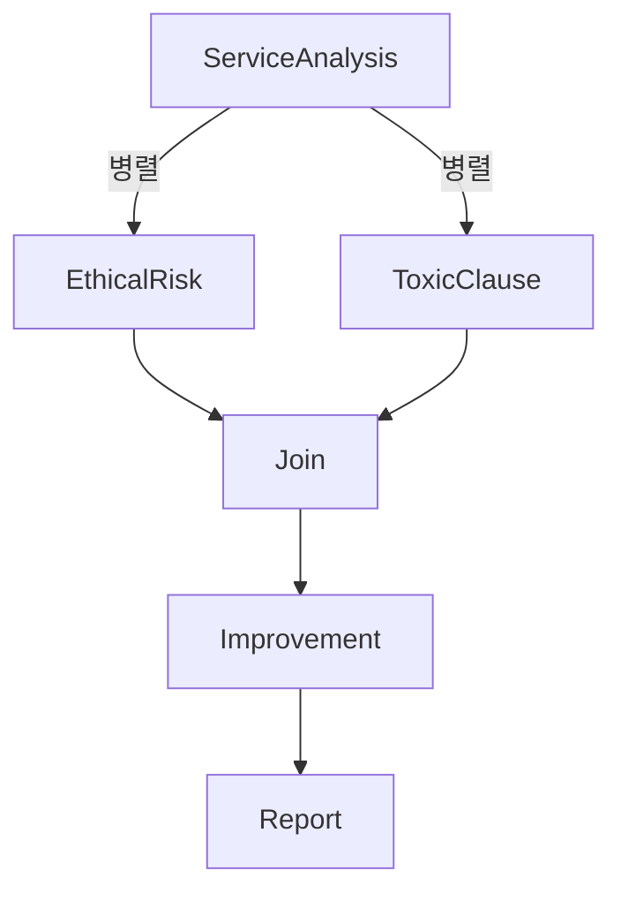

# AI 윤리 리스크 진단 멀티에이전트 시스템

본 프로젝트는 AI 윤리성 리스크 진단 에이전트들을 설계하고 구현하였습니다.
특정 AI 서비스의 편향성, 프라이버시, 설명가능성, 자동화 위험성 등을 진단하고 개선 방향을 제시합니다. 
LangGraph 기반 AI 멀티 에이전트 아키텍처로 구성되며 최종적으로 윤리 진단 리포트를 자동 생성합니다.

## 초기 환경 설정

### 1. mac OS 환경 설정 (PDF 생성을 위한 환경 설정)
```bash
brew install pango cairo libffi gdk-pixbuf
```
다른 OS의 경우: WeasyPrint 공식 문서를 참고하여 관련 라이브러리를 설치하십시오.

## A. 서비스 목적 정의

목표: 특정 AI 서비스에 대해 OECD 주요 가이드라인 등 관련 문서를 RAG(Retrieval Augmented Generation)로 참조하여 윤리적 리스크를 심층 진단하고, 이를 개선하기 위한 자동화된 리포트(Markdown 및 PDF)를 생성하는 에이전트 기반 시스템 구축.

서비스 대상: 사용자가 제공하는 서비스 관련 문서(PDF) 및 URL (선택 사항). 예: Daglo AI Guide (https://daglo.ai/guide)

### 범위 제한:

진단 기준은 주요 글로벌 윤리가이드라인 중 OECD 가이드라인을 중심으로 RAG를 통해 참조합니다.

독소조항 검토는 서비스 관련 문서(PDF, TXT, MD 등)에서 RAG를 통해 약관 및 개인정보처리방침 관련 내용을 추출하여 분석합니다.

보고서 생성 시, 각 에이전트는 RAG를 통해 서비스 문서 및 가이드라인 문서에서 관련 정보를 적극적으로 검색하고 활용합니다.

## B. 보고서 정의

최종 보고서 항목 (Markdown 및 PDF 형식으로 생성):

0. **SUMMARY** : 보고서 전체 내용을 심도 있게 요약 (자동 생성).

1.  **서비스 개요** : 서비스 기능, 대상, 수집 데이터, URL 상태, 정보 출처 등 상세 분석.

2. **AI 윤리성 리스크 심층 평가**: 편향성(Bias), 프라이버시(Privacy), 설명가능성(Explainability), 자동화(Automation) 리스크에 대한 수준 평가 및 RAG 기반 상세 근거(출처 인용 포함) 제시.

3. **약관 및 개인정보 처리방침 심층 분석 (독소조항)**: 전반적 위험도 평가 및 주요 독소조항 내용, 위험성, 사용자 영향, 근거 자료(RAG 기반) 상세 분석.

4. **종합 개선 방향 및 실행 로드맵 제안**: 각 리스크 및 독소조항에 대한 구체적이고 다각적인 개선 방안 제시.

5. **사용된 윤리 가이드라인 및 참고자료**: 분석에 활용된 주요 가이드라인 및 RAG를 통해 참조된 문서 정보 요약.


### 서비스 개요

실용 서비스 기능 분석
윤리성 리스크 평가 (Bias, Privacy, Explainability, Automation Risk)
독소조항 목록 및 평가
서비스 개선 방향 제안
사용된 윤리 가이드라인 명세
보고서 생성 프롬프트 예시

## C. Architecture 정의


### 시스템 아키텍처 개요

* **초기 구조**: 순차적 실행
* **개선 구조**: `ServiceAnalysisAgent` 이후 `EthicalRiskAgent`, `ToxicClauseAgent`를 **병렬 실행**, 이후 결과를 종합하여 `ImprovementAgent`, `ReportComposerAgent`로 전달



---

### Agent 정의 및 목적

| Agent Name               | 목적                                              |
| ------------------------ | ----------------------------------------------- |
| **ServiceAnalysisAgent** | RAG 기반으로 서비스 기능, 대상, 수집 데이터 등을 상세 분석            |
| **EthicalRiskAgent**     | OECD 등 기준 기반 윤리 항목별 리스크 진단 (근거 출처 포함, 상세 설명 제공) |
| **ToxicClauseAgent**     | 약관/개인정보 문서에서 독소 조항 탐지, 위험도 평가 및 근거 출처 제시        |
| **ImprovementAgent**     | 탐지된 문제에 대해 항목별 최소 2개 이상의 개선 방안 도출               |
| **ReportComposerAgent**  | 전체 결과 종합 → Markdown + PDF 보고서 자동 생성             |

---

### 사용 도구

| Agent                    | 사용 도구                                                     |
| ------------------------ | --------------------------------------------------------- |
| **ServiceAnalysisAgent** | `RAG` (ChromaDB + EnsembleRetriever), `PyMuPDF`, `GPT-4o` |
| **EthicalRiskAgent**     | `RAG` (OECD 문서 기반), `GPT-4o`, 상세 프롬프트                     |
| **ToxicClauseAgent**     | `RAG` (법적 키워드 기반 약관 분석), `GPT-4o`, 상세 프롬프트                |
| **ImprovementAgent**     | `GPT-4o`, 상세 프롬프트 기반 개선안 생성                               |
| **ReportComposerAgent**  | `GPT-4o`, Markdown to HTML, `weasyprint` (PDF 변환)         |

---

## 주요 Features

* 사용자가 제공한 서비스 관련 문서 디렉토리(`--service_data_dir`) 기반 자동 분석.
* **문서 인덱싱**: `indexer.py`를 통해 서비스별 PDF 문서 및 제공된 가이드라인 문서를 청킹하고, `sentence-transformers/all-MiniLM-L6-v2` 모델을 사용하여 임베딩 후 **서비스별 로컬 ChromaDB 벡터 저장소**에 저장.
* **하이브리드 검색 (Hybrid Search)**:
    * `retriever.py`에서 `EnsembleRetriever`를 구성하여 의미 기반 검색(Semantic Search)과 키워드 기반 검색(Lexical Search)을 결합.
    * **Semantic Search**: ChromaDB에 저장된 벡터와 사용자 쿼리 간의 유사도 검색 (HuggingFaceEmbeddings 사용).
    * **Lexical Search**: `BM25Retriever`를 사용하여 원본 문서 텍스트에서 키워드 기반 검색.
* **심층 RAG 활용**:
    * `ServiceAnalysisAgent`: 서비스 개요 분석 시 RAG를 통해 관련 문서에서 정보 추출.
    * `EthicalRiskAgent`: 윤리 리스크 평가 시, OECD AI 가이드라인 등 특정 문서를 RAG로 참조하고, **평가 근거에 해당 문서의 내용과 출처(문서명, 페이지, 섹션 등)를 명시적으로 인용**.
    * `ToxicClauseAgent`: 서비스 관련 문서에서 약관/개인정보처리방침 내용을 RAG로 추출하고, **정의된 법적 주요 키워드별로 상세 RAG를 반복 수행**하여 독소 조항 탐지 및 근거 확보.
    
* 국제적 기준(예: OECD AI 가이드라인)을 RAG로 참조하여 윤리성 리스크 자동 심층 진단 및 구체적 근거/출처 제시.
* 구체적이고 실행 가능한 다각적 개선 방안 생성.
* Markdown 및 고품질 PDF 형식(`weasyprint` 사용)의 상세 보고서 자동 생성.
* LangGraph를 이용한 병렬 및 순차적 에이전트 워크플로우 관리, 오류 처리 및 타임아웃 기능 포함.
* 각 에이전트의 상세한 역할 및 출력 형식을 정의한 프롬프트 파일(`prompts/` 폴더) 사용.


---

## 기술 스택

| Category      | Details                                              |
| ------------- | ---------------------------------------------------- |
| **Framework** | LangGraph, LangChain, Python                         |
| **LLM**       | GPT-4o (또는 설정 가능한 모델)                                |
| **RAG**       | ChromaDB, EnsembleRetriever (BM25 + Semantic Hybrid) |
| **Parser**    | PyMuPDF, Markdown                                    |
| **Exporter**  | weasyprint (HTML → PDF)                              |

---

## LangGraph 상태 변수 (State)

| Key                   | Description                        |
| --------------------- | ---------------------------------- |
| `service_url`         | 분석 대상 서비스 URL (선택 사항)              |
| `documents`           | 분석 문서 전체 경로 리스트                    |
| `service_info`        | 서비스 분석 결과 (기능, 대상, 수집 데이터 등)       |
| `ethical_risks`       | 윤리 리스크 상세 결과 (Bias, Privacy 등)     |
| `toxic_clauses`       | 탐지된 독소조항 목록                        |
| `overall_clause_risk` | 전반적 약관 위험도                         |
| `recommendations`     | 개선안 목록 (각 항목별 2개 이상)               |
| `final_report`        | 보고서 경로 (Markdown, PDF), 생성 상태 등    |
| `ethical_risk_done`   | `EthicalRiskAgent` 완료 여부 (Boolean) |
| `toxic_clause_done`   | `ToxicClauseAgent` 완료 여부 (Boolean) |
| `join_attempt_count`  | Join 노드 재시도 횟수 (타임아웃 제어용)          |
| `error_message`       | 실행 중 발생한 오류 메시지                    |

---

## 예시 출력 형식

```json
{
  "service_info": {
    "service_name": "Daglo AI Guide",
    "core_features": ["문서 요약", "인터랙티브 가이드"],
    "collected_data_types": ["텍스트 입력", "클릭 로그"]
  },
  "ethical_risks": {
    "bias": { "risk_level": "중간", "evidence": "...", "source": "OECD" },
    "privacy": { "risk_level": "높음", "evidence": "...", "source": "OECD" }
  },
  "toxic_clauses": [
    {
      "clause": "개인정보 제3자 제공",
      "risk": "과도한 권한 요구",
      "source": "privacy_policy.pdf"
    }
  ],
  "recommendations": {
    "privacy": [
      "데이터 최소 수집 원칙 도입",
      "개인정보 자동 삭제 주기 명시"
    ]
  },
  "final_report": {
    "markdown_path": "./reports/daglo_analysis.md",
    "pdf_path": "./reports/daglo_analysis.pdf"
  }
}
```

---

## 주의사항 및 설계 주안점

* 병렬 실행 시 `ethical_risk_done`과 `toxic_clause_done` 모두 완료되어야 `Join` → `ImprovementAgent`로 전이 가능
* `join_attempt_count`를 활용한 재시도 및 타임아웃 설정 권장
* 각 Agent의 입력/출력 구조를 명확히 고정하여 워크플로우의 일관성 유지
* RAG용 문서는 반드시 벡터화 후 임베딩된 상태에서 쿼리


## Directory Structure
```bash
├── README.md 
├── agents # 에이전트 소스 코드
│   ├── __init__.py
│   ├── ethical_risk_agent.py
│   ├── improvement_agent.py
│   ├── report_composer_agent.py
│   ├── service_analysis_agent.py
│   └── toxic_clause_agent.py
├── app.py # 메인 애플리케이션 소스 코드
├── data # 데이터 파일
│   ├── claude
│   ├── daglo
│   └── deepseek
├── graph.py # LangGraph 소스 코드
├── guidelines # 윤리 가이드라인 파일
│   ├── OECD-AI-규제파일(202106).pdf
│   └── eu_ai_act_summary.md
├── indexing # 인덱싱 및 검색 관련 코드
│   ├── __init__.py
│   ├── indexer.py
│   └── retriever.py
├── outputs
│   ├── ethics_report_Claude_20250520_152247.md
│   ├── ethics_report_Claude_20250520_152247.pdf
│   ├── ethics_report_DeepSeek_20250520_152437.md
│   ├── ethics_report_DeepSeek_20250520_152437.pdf
│   ├── ethics_report_다글로_20250520_151904.md
│   └── ethics_report_다글로_20250520_151904.pdf
├── prompts # 프롬프트 템플릿
│   ├── ethical_risk_system.txt
│   ├── ethical_risk_user.txt
│   ├── improvement_system.txt
│   ├── improvement_user.txt
│   ├── report_composer_system.txt
│   ├── report_composer_user.txt
│   ├── service_analysis_system.txt
│   ├── service_analysis_user.txt
│   ├── toxic_clause_system.txt
│   └── toxic_clause_user.txt
├── requirements.txt # 필요한 라이브러리 목록
├── state_definition.md # 상태 정의
├── utils  # 유틸리티 함수
│   ├── __init__.py
│   └── load_prompt.py
└── vectorstore # 벡터 데이터베이스 저장 위치
```

## Contributors

takenkp
* Agent Design
* Prompt Engineering
* LangGraph Flow 설계 및 구현 (병렬 처리, 동기화, 오류 처리 포함)
* RAG 시스템 통합 (ChromaDB, EnsembleRetriever, 키워드별 상세 검색)
* PDF 보고서 변환 기능 구현 (weasyprint)
* CLI 인터페이스 및 전체

